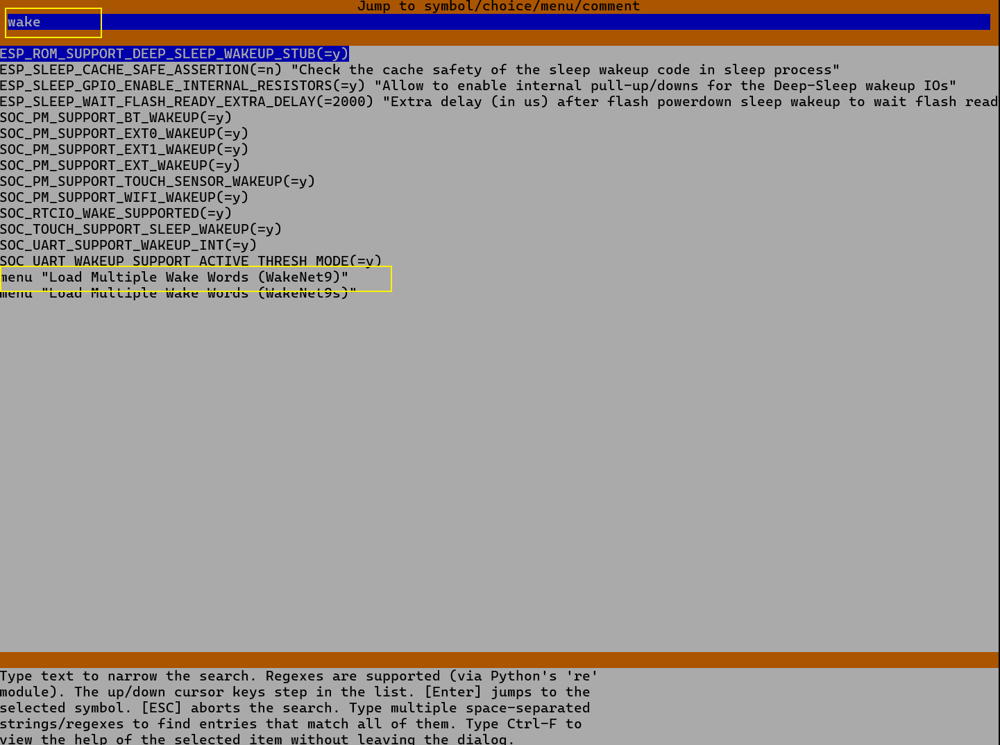
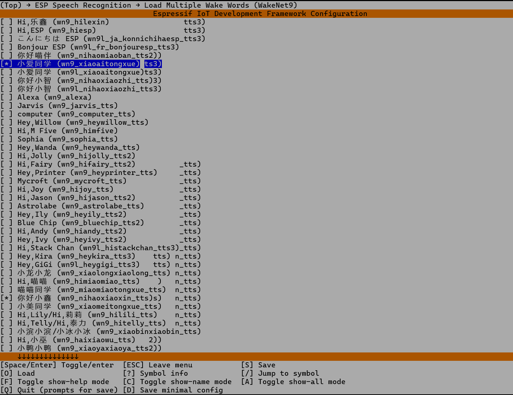

# ESP32-S3 WakeNet 模型编译与烧录说明

本文档用于记录本项目中 ESP-SR / WakeNet 模型的生成、配置和烧录流程。
适用当前项目：

```text
项目目录：D:\devel\project\eps32-s3-n16r8\esp32-wake-demo
PlatformIO 环境名：esp32-s3-n16R8-wake-demo
目标芯片：ESP32-S3 N16R8
Flash：16MB
PSRAM：8MB
ESP-IDF：5.5.x
IDE: visual studio code + pioarduion plugin
```

## 预览效果
### 语音监听画面


### 语音命中画面


### 语音命中动画


---

## 1. 当前分区规划

```csv
# Name,       Type, SubType,  Offset,   Size,     Flags
nvs,          data, nvs,       0x9000,   0x5000,
otadata,      data, ota,       0xe000,   0x2000,
app0,         app,  ota_0,     0x10000,  0x300000,
app1,         app,  ota_1,     0x310000, 0x300000,
spiffs,       data, spiffs,    0x610000, 0x100000,
model,        data, ,          0x710000, 0x5E0000,
voice_data,   data, fat,       0xCF0000, 0x300000,
coredump,     data, coredump,  0xFF0000, 0x10000,
```

关键点：

```text
model 分区 Offset：0x710000
model 分区 Size：  0x5E0000，约 6016KB
```

`model` 分区必须是：

```csv
model, data, , 0x710000, 0x5E0000,
```

不要写成：

```csv
model, data, spiffs, 0x710000, 0x5E0000,
```

否则 ESP-SR 可能读错分区。

---

## 2. WakeNet、MultiNet、srmodels.bin 的关系

```text
WakeNet：唤醒词检测模型，模型名通常以 wn 开头，例如 wn9_xiaoaitongxue
MultiNet：离线命令词识别模型，模型名通常以 mn 开头，例如 mn6_cn
```

本项目当前主要做本地唤醒，所以重点是 WakeNet。

`srmodels.bin` 是 ESP-SR 模型打包后的二进制文件，需要烧录到 `model` 分区：

```text
srmodels.bin → 烧录到 Flash 地址 0x710000
```

PlatformIO 的 `data/` 目录通常用于 SPIFFS / LittleFS，不等于 ESP-SR 的 `model` 分区。

---

## 3. MenuConfig 配置模型

进入项目目录：

```cmd
cd /d D:\devel\project\eps32-s3-n16r8\esp32-wake-demo
```

打开 menuconfig：

```cmd
pio run -t menuconfig
```

进入：

```text
Component config
  ESP Speech Recognition
```

重点看 WakeNet 菜单：

```text
Load Multiple Wake Words (WakeNet9s)  --->
Load Multiple Wake Words (WakeNet9)   --->
```

不要把下面这些 MultiNet 命令识别模型当成唤醒词模型：

```text
chinese recognition (mn5q8_cn)
general chinese recognition (mn6_cn)
general chinese recognition (mn7_cn)
```

判断规则：

```text
wn = WakeNet，唤醒词
mn = MultiNet，命令词识别
```

只做语音唤醒时，MultiNet 可以保持 `None`。

键盘按```/```进入搜索页面，搜索```wake```，选中后按```s```保存





---

## 4. 当前已验证模型配置

当前 `sdkconfig.esp32-s3-n16R8-wake-demo` 中已验证过的配置示例：

```text
CONFIG_SR_WN_WN9_XIAOAITONGXUE=y
CONFIG_SR_WN_WN9_NIHAOXIAOZHI_TTS=y
```

启动日志中已验证包含：

```text
model[0]: name=wn9_nihaoxiaozhi      info=wakenet9_v1h12_你好小智_3_0.585_0.595
model[1]: name=wn9_nihaoxiaozhi_tts  info=wakenet9l_tts1h8_你好小智_3_0.631_0.635
model[2]: name=wn9_xiaoaitongxue     info=WakeNet9_v1h24_小爱同学_3_0.620_0.627
```

当前程序选择：

```text
Selected model: wn9_xiaoaitongxue
Wake word: 小爱同学
```

因此当前测试唤醒词是：

```text
小爱同学
```

后续若只想保留一个模型，建议只保留：

```text
CONFIG_SR_WN_WN9_XIAOAITONGXUE=y
```

---

## 5. 生成 srmodels.bin

### 5.1 确认 sdkconfig 文件

PlatformIO 环境下配置文件一般是：

```text
sdkconfig.esp32-s3-n16R8-wake-demo
```

确认命令：

```cmd
dir /b sdkconfig*
```

### 5.2 删除旧模型缓存

```cmd
rmdir /s /q .pio\build\esp32-s3-n16R8-wake-demo\srmodels
```

### 5.3 执行 movemodel.py

```cmd
python managed_components\espressif__esp-sr\model\movemodel.py -d1 sdkconfig.esp32-s3-n16R8-wake-demo -d2 managed_components\espressif__esp-sr -d3 .pio\build\esp32-s3-n16R8-wake-demo
```

参数说明：

```text
-d1：sdkconfig 文件路径
-d2：esp-sr 组件路径
-d3：PlatformIO build 输出目录
```

成功时会看到类似：

```text
ESP-SR Models Report
────────────────────────────────────────
  Models loaded from esp-sr:
    - wn9_nihaoxiaozhi_tts (284.06 KB)
    - wn9_xiaoaitongxue    (284.17 KB)

  Recommended Partition Size: 570K
────────────────────────────────────────
```

---

## 6. 检查 srmodels.bin

```cmd
dir .pio\build\esp32-s3-n16R8-wake-demo\srmodels
```

正常示例：

```text
2026/06/17  19:13           872,735 srmodels.bin
2026/06/17  18:44    <DIR>          wn9_nihaoxiaozhi
2026/06/17  17:09    <DIR>          wn9_nihaoxiaozhi_tts
2026/06/17  18:44    <DIR>          wn9_xiaoaitongxue
```

当前验证过的正常大小：

```text
srmodels.bin = 872,735 字节
```

当前 `model` 分区大小：

```text
0x5E0000 = 6,160,384 字节 ≈ 6016KB
```

`srmodels.bin` 必须小于该大小。

异常示例：

```text
srmodels.bin = 27,191,582 字节
```

这种不能烧录，会覆盖后面的 `voice_data`、`coredump` 分区。处理方式是删除 `.pio\build\...\srmodels` 后重新生成。

---

## 7. 烧录 srmodels.bin 到 model 分区

### 7.1 查看串口号

```cmd
pio device list
```

假设串口是：

```text
COM3
```

下面命令中的 `COM5` 改成实际串口。

### 7.2 擦除 model 分区

```cmd
pio pkg exec -p tool-esptoolpy -- esptool.py --chip esp32s3 --port COM5 --baud 921600 erase_region 0x710000 0x5E0000
```

### 7.3 写入 srmodels.bin

```cmd
pio pkg exec -p tool-esptoolpy -- esptool.py --chip esp32s3 --port COM5 --baud 921600 write_flash 0x710000 .pio\build\esp32-s3-n16R8-wake-demo\srmodels\srmodels.bin
```

### 7.4 打开串口监视器

```cmd
pio device monitor --port COM5 --baud 115200
```

---

## 8. 烧录应用固件、分区表、Bootloader

编译应用：

```cmd
pio run
```

上传应用固件：

```cmd
pio run -t upload
```

擦除整片 Flash：

```cmd
pio run -t erase
```

分区表变更、Flash 状态异常、模型烧错地址时，建议整片擦除后重新上传固件和模型：

```cmd
pio run -t erase
pio run
pio run -t upload
```

然后重新烧录 `srmodels.bin`：

```cmd
pio pkg exec -p tool-esptoolpy -- esptool.py --chip esp32s3 --port COM5 --baud 921600 erase_region 0x710000 0x5E0000

pio pkg exec -p tool-esptoolpy -- esptool.py --chip esp32s3 --port COM5 --baud 921600 write_flash 0x710000 .pio\build\esp32-s3-n16R8-wake-demo\srmodels\srmodels.bin
```

---

## 9. 什么时候需要重新烧 srmodels.bin

需要重新烧模型：

```text
1. 修改了 WakeNet 模型选择
2. 修改了 sdkconfig 中 ESP-SR 模型相关配置
3. 修改了 partition.csv 中 model 分区地址或大小
4. 执行过整片 erase
5. 出现 No models found in 'model' partition
```

不需要重新烧模型：

```text
1. 只改普通业务代码
2. 只改 LCD 显示逻辑
3. 只改 HTTP / MQTT 业务逻辑
4. 只改日志输出
```

这种情况通常只需要：

```cmd
pio run -t upload
```

---

## 10. 完整操作流程

### 首次烧录或分区变更后

```cmd
cd /d D:\devel\project\eps32-s3-n16r8\esp32-wake-demo

pio run -t erase

pio run

pio run -t upload

rmdir /s /q .pio\build\esp32-s3-n16R8-wake-demo\srmodels

python managed_components\espressif__esp-sr\model\movemodel.py -d1 sdkconfig.esp32-s3-n16R8-wake-demo -d2 managed_components\espressif__esp-sr -d3 .pio\build\esp32-s3-n16R8-wake-demo

pio pkg exec -p tool-esptoolpy -- esptool.py --chip esp32s3 --port COM5 --baud 921600 erase_region 0x710000 0x5E0000

pio pkg exec -p tool-esptoolpy -- esptool.py --chip esp32s3 --port COM5 --baud 921600 write_flash 0x710000 .pio\build\esp32-s3-n16R8-wake-demo\srmodels\srmodels.bin

pio device monitor --port COM5 --baud 115200
```

### 只改业务代码

```cmd
cd /d D:\devel\project\eps32-s3-n16r8\esp32-wake-demo

pio run -t upload

pio device monitor --port COM5 --baud 115200
```

### 只改 WakeNet 模型选择

```cmd
cd /d D:\devel\project\eps32-s3-n16r8\esp32-wake-demo

pio run -t menuconfig

rmdir /s /q .pio\build\esp32-s3-n16R8-wake-demo\srmodels

python managed_components\espressif__esp-sr\model\movemodel.py -d1 sdkconfig.esp32-s3-n16R8-wake-demo -d2 managed_components\espressif__esp-sr -d3 .pio\build\esp32-s3-n16R8-wake-demo

pio pkg exec -p tool-esptoolpy -- esptool.py --chip esp32s3 --port COM5 --baud 921600 erase_region 0x710000 0x5E0000

pio pkg exec -p tool-esptoolpy -- esptool.py --chip esp32s3 --port COM5 --baud 921600 write_flash 0x710000 .pio\build\esp32-s3-n16R8-wake-demo\srmodels\srmodels.bin

pio device monitor --port COM5 --baud 115200
```

---

## 11. 正常启动日志

模型烧录正确后，应看到：

```text
I wake_demo: Loading models from 'model' partition...
I MODEL_LOADER: The partition size is 6016 KB
I MODEL_LOADER: Successfully load srmodels
I wake_demo: Found 3 model(s) in partition
I wake_demo:   model[0]: name=wn9_nihaoxiaozhi info=wakenet9_v1h12_你好小智_3_0.585_0.595
I wake_demo:   model[1]: name=wn9_nihaoxiaozhi_tts info=wakenet9l_tts1h8_你好小智_3_0.631_0.635
I wake_demo:   model[2]: name=wn9_xiaoaitongxue info=WakeNet9_v1h24_小爱同学_3_0.620_0.627
I wake_demo: Selected model: wn9_xiaoaitongxue
I wake_demo: Wake word: 小爱同学
I wake_demo: WakeNet ready: rate=16000 chunk=512 channels=1 words=1
I wake_demo: Listening for "小爱同学"...
```

---

## 12. 常见问题

### No models found in 'model' partition

常见原因：

```text
1. 没有生成 srmodels.bin
2. 没有把 srmodels.bin 烧到 0x710000
3. model 分区被擦除了
4. srmodels.bin 烧录地址错误
5. model 分区 subtype 写成了 spiffs
```

处理：

```cmd
rmdir /s /q .pio\build\esp32-s3-n16R8-wake-demo\srmodels

python managed_components\espressif__esp-sr\model\movemodel.py -d1 sdkconfig.esp32-s3-n16R8-wake-demo -d2 managed_components\espressif__esp-sr -d3 .pio\build\esp32-s3-n16R8-wake-demo

pio pkg exec -p tool-esptoolpy -- esptool.py --chip esp32s3 --port COM5 --baud 921600 erase_region 0x710000 0x5E0000

pio pkg exec -p tool-esptoolpy -- esptool.py --chip esp32s3 --port COM5 --baud 921600 write_flash 0x710000 .pio\build\esp32-s3-n16R8-wake-demo\srmodels\srmodels.bin
```

### MODEL_LOADER 显示 partition size 是 1024 KB

当前项目的 `model` 分区应是 6016KB。出现 1024KB 通常说明读到了 `spiffs` 分区。

检查分区表，确保：

```csv
model, data, , 0x710000, 0x5E0000,
```

### movemodel.py 报 FileNotFoundError: sdkconfig

PlatformIO 项目一般使用：

```text
sdkconfig.esp32-s3-n16R8-wake-demo
```

确认：

```cmd
dir /b sdkconfig*
```

然后用实际文件名：

```cmd
python managed_components\espressif__esp-sr\model\movemodel.py -d1 sdkconfig.esp32-s3-n16R8-wake-demo -d2 managed_components\espressif__esp-sr -d3 .pio\build\esp32-s3-n16R8-wake-demo
```

### srmodels.bin 过大

如果看到：

```text
srmodels.bin = 27MB
```

不要烧录。先删目录再重新生成：

```cmd
rmdir /s /q .pio\build\esp32-s3-n16R8-wake-demo\srmodels
```

### esptool 连接失败

处理方式：

```text
1. 确认串口号：pio device list
2. 关闭串口监视器
3. 按住 BOOT
4. 按一下 RST
5. 松开 BOOT
6. 重新执行烧录命令
```

### WakeNet 初始化成功但唤醒不出来

优先检查：

```text
1. INMP441 的 SCK / WS / SD 引脚是否正确
2. I2S 采样率是否为 16kHz
3. WakeNet 输入是否是 mono 单声道
4. 32-bit I2S 数据是否正确转换为 16-bit PCM
5. 是否取错左右声道
6. 麦克风增益是否过低
7. 环境噪声是否太大
8. 阈值是否设置过高
```

---

## 13. 当前固定参数速查

```text
项目目录：
D:\devel\project\eps32-s3-n16r8\esp32-wake-demo

PlatformIO 环境：
esp32-s3-n16R8-wake-demo

sdkconfig：
sdkconfig.esp32-s3-n16R8-wake-demo

ESP-SR 组件：
managed_components\espressif__esp-sr

srmodels.bin：
.pio\build\esp32-s3-n16R8-wake-demo\srmodels\srmodels.bin

model 分区地址：
0x710000

model 分区大小：
0x5E0000

当前测试唤醒词：
小爱同学

当前选择模型：
wn9_xiaoaitongxue
```


